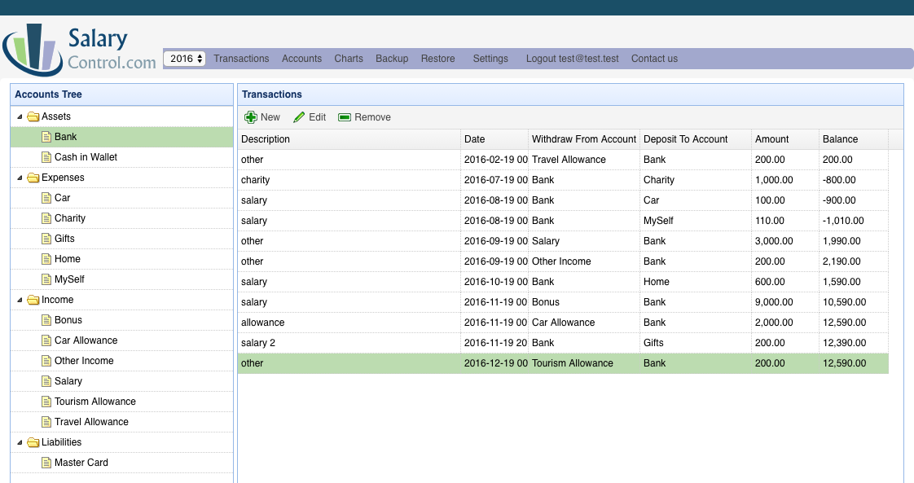
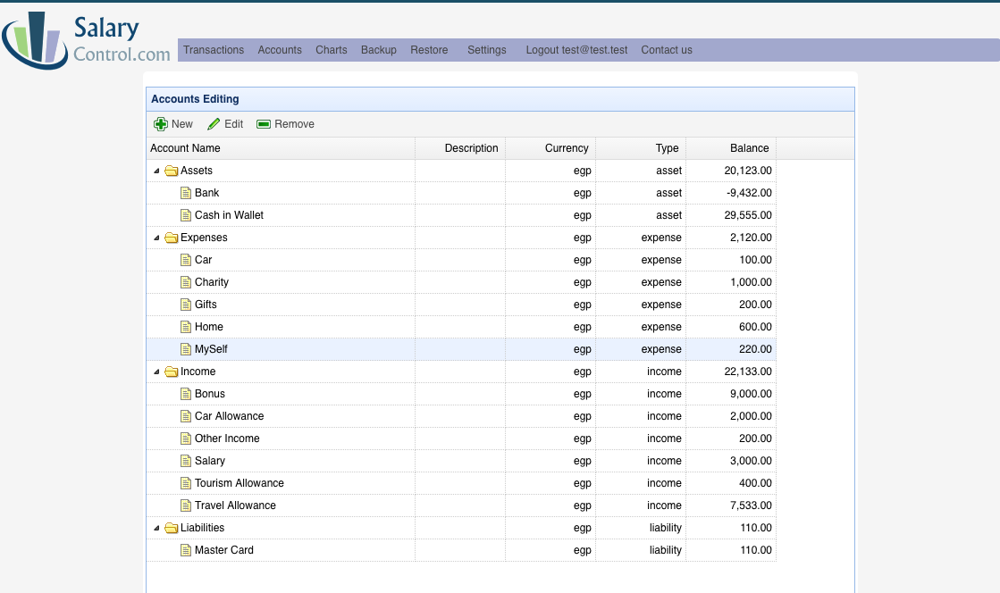
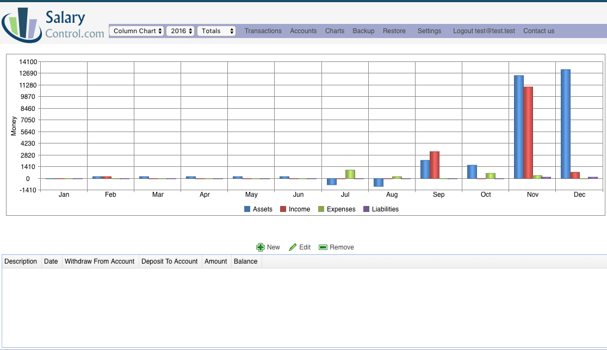

Personal Finance Web
=====================

* This is a multiuser system for handling finances. 
* The sample data uses the following account email test@test.test and password is test.
* You need to create database user to match application.properties, as following:  

    CREATE USER 'pf_local'@'localhost' IDENTIFIED BY 'secret';
    GRANT ALL PRIVILEGES ON * . * TO 'pf_locla'@'localhost';
    FLUSH PRIVILEGES;

Why developing it?
-------------------
* I tried many tools to manage my finance but I was not satisfied by any. At the same time, I
 want to develop some software to keep my programming skills active, so I started this project.
 
 
Technology:
-----------
* The software uses Spring boot.
* The code used MySQL database through Hibernate Mysql driver. 
* The code send email using smtp.sendgrid.net, with fictional account. In order to be able to get email notifications, you must configure 
a correct user name and password.  

License:
--------
* Usage and contributions are welcomed.
* The text and code is license as GNU 3.0 located at: https://www.gnu.org/copyleft/gpl.html

Screen shots:
=============
The following screen shots are utilizing and showing sample test data.

Transactions View:
-------------------

Accounts View:
--------------

Charts View:
------------

